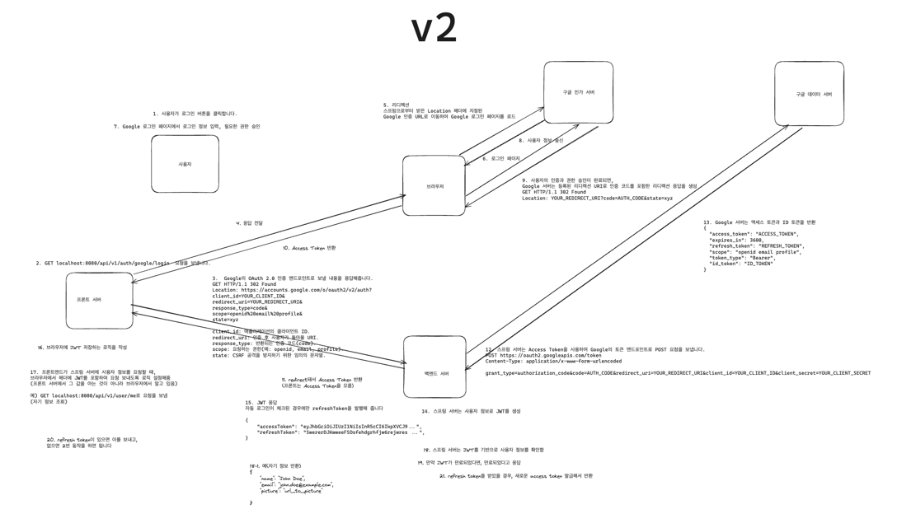

## [유저]
- 유저는 회원가입을 통해 회원가입을 할 수 있다.

  - 유저는 Google 간편 로그인을 할 수 있다. (OAuth2.0) 
    - Google로부터 받아올 개인정보는 이름, email이다.
    - 프론트엔드에서 개인정보를 조회할 수 있다.
      - GET localhost:8080/api/v1/user/me
        - 브라우저 헤더에 JWT가 필요하다.
        - JWT가 없으면 401 Unauthorized를 반환한다.
        - JWT가 유효하지 않으면 401 Unauthorized를 반환한다.
      - MySQL RDB에 유저 개인 정보가 저장되어 있다.
      - RDB에서 유저 개인 정보를 조회할 수 있다.
        - 유저id로_개인_정보를_조회할_수_없으면_예외가_발생한다
        - 유저를_생성할_수_있다
    - [X] 프론트엔드에 구글 인가 서버에 보낼 데이터를 HTTP API로 제공한다. 
      - [X] GET/POST localhost:8080/api/v1/auth/google/login 
      - 이미 로그인된 사용자가 요청하면 400 Bad Request를 반환한다.
        - 이미 로그인되었다는 기준은 JWT가 유효한지 여부이다. (이 부분 테스트 어떻게 할 지 고민 중)
    - [X] 보내줄 데이터 예시
      - [X] client_id: 애플리케이션의 클라이언트 ID.
      - [X] redirect_uri: 인증 후 사용자가 돌아올 URI.
      - [X] response_type: 반환되는 인증 코드(code).
      - [X] scope: 요청하는 권한(예: openid, email, profile).
      - state(선택): CSRF 공격을 방지하기 위한 임의의 문자열.
- [X] 예시
~~~
GET HTTP/1.1 302 Found
Location: https://accounts.google.com/o/oauth2/v2/auth?
client_id=YOUR_CLIENT_ID&
redirect_uri=http://localhost:8080/api/v1/auth/google/redirect
response_type=code&
scope=openid%20email%20profile&
state=xyz  
~~~   
ㅤ
- 사용자가 구글 인가 페이지에서 로그인을 성공시켰으면, 구글이 프론트 서버를 통해 http://localhost:8080/api/v1/auth/google/redirect 로 보내는 리다이렉트를 받는다.
  - 이 요청에는 구글 인가 서버에서 발급한 유저의 Access Token과 Refresh Token이 담겨있다.
- 구글 데이터 서버에 Access Token을 통해 유저의 정보를 요청하고 받아온다.
~~~
POST https://oauth2.googleapis.com/token
Content-Type: application/x-www-form-urlencoded
grant_type=authorization_code&code=AUTH_CODE&redirect_uri=YOUR_REDIRECT_URI&client_id=YOUR_CLIENT_ID&client_secret=YOUR_CLIENT_SECRET
~~~
- JWT를 발행한다.
- JWT를 response body에 담아 json형태로 반환한다.

- API는 Swagger에서 확인 가능하다.
  - http://localhost:8080/swagger-ui.html

- 유저는 자동 로그인을 할 수 있다.
- 유저는 로그아웃을 할 수 있다.
- 유저는 회원탈퇴를 할 수 있다.
- (유저는 회원정보를 수정할 수 있다.)
