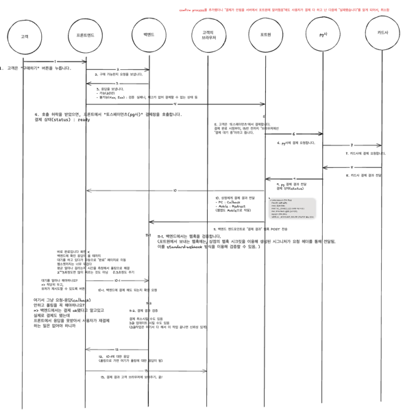
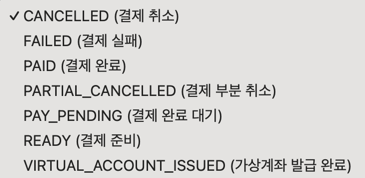

## 단건 결제

- [X] 포트원의 결제 API를 호출하려면 "포트원 API Secret"을 헤더에 넣거나, "포트원 API Access Token"을 헤더에 넣어야 합니다.
  - [X] 해당 API들은 백엔드에서만 호출합니다.
  - [X] API Secret은 만료기간이 더 깁니다. 
  - [X] 어차피 백엔드에서는 secret알고있는 상황이고, 이 access token이 필요한 경우에는, secret을 모르는 사람에게 짧은 시간동안 권한을 빌려주기 위함이다. 
   즉, 우리 입장에서는 필요가 없으므로, "포트원 API Secret"을 사용하도록 합니다.

- ~~포트원 API Access Token 및 Refresh Token 발급받는 방법~~ 
  - ~~최신 정보는 https://developers.portone.io/api/rest-v2/auth 참고~~
~~~
curl --request post \
  --url https://api.portone.io/login/api-secret \
  --header 'Content-Type: application/json' \
  --data '{"apiSecret":"your-api-secret"}'
~~~

- [X] 백엔드에서 포트원 API 호출 시 RestClient를 사용합니다.

### [1~3]
- [X] 고객이 "구매하기" 버튼을 눌렀을 때, 프론트에서는 백엔드에 다음을 요청합니다.
  - 구매 가능한가?
  - [X] 고유한 paymentId 
- [X] 프론트에서 요청하는 포맷은 다음과 같습니다.
~~~
Header Authorization: Bearer {accessToken}

Body
{
  "paymentProducts": [
    {
      "productId": "example-product-id", // 상품의 고유 번호
      "quantity": 1, // 상품의 수량
      "price": 1000 // 상품의 가격
    },
    {
      "productId": "example-product-id-2",
      "quantity": 2,
      "price": 2000
    }
  ],
  "totalPrice": 3000,
  "requestTime: "2024-04-25T10:00:00.000Z", // TODO: 프론트값 말고 서버값을 쓸 것 (프론트값은 거의 신뢰하지 않아도 됨)
}
~~~

- 구매 불가능한 상황이란?
  - a) 모든 유저: "유저는 1초에 구매 요청을 한 번만 할 수 있다" 라는 가정을 둔다. 유저가 1초에 여러 번 구매 요청을 보내면, 첫 번째 요청만 처리하게 된다.
    - DB에 구매 요청 왔다는걸 기록하고, 또 다른 요청이 도착했으면 1초 내에 요청했던 사람이면 거절한다.
    - [구매 요청 테이블]
      - request_id (Primary Key)
      - user_id (필요 시 유저 테이블과 연결되지만 FK 제약조건은 없다.)
      - request_timestamp (프론트에서 보내주는, 구매 요청이 이루어진 시간)
    - 분산 서버 환경에서도 동작해야 한다.
      - (⭐️동시성 처리-1) RDB를 쓰는 경우, SELECT FOR UPDATE로 행 단위 락을 건다.
      - 새로운 요청의 타임스탬프가 그 유저의 가장 최신 요청의 타임스탬프보다 더 빠르면, 이 요청은 거절한다.
      - 새로운 요청의 타임스탬프가, 그 유저의 가장 최신 요청의 타임스탬프보다 1초 이상 늦게 도착했으면, 이 요청은 허용한다.
      - (Select 된 행만 락이 걸릴 것인지 테스트할 것)
    - 추후에 Redis로 이 요청을 기록한다.
      - 이유는 다음과 같다. 1초에 한 번씩이라는 기준이면 DB I/O가 너무 많아질 것
      - 그리고 RDB는 expired를 처리해주는 로직이 없다. 직접 개발자가 배치같은걸 돌려서 해줘야함. (Redis에서는 expired를 설정해줄 수 있다.)

  - b) 재고가 있는 상품: 재고가 0개일 때
    - 추후 구독제 구현할 때 작성

  - [X] c) 모든 상품: 이 상품을 팔면, 프로젝트 전체의 판매액이 762만원을 넘어가는 구매일 때 거절한다
    - [X] [총 판매액 테이블]
      - [X] id (Primary Key)
      - [X] total_sales (총 판매액)
    - [X] SELECT FOR UPDATE로 행 단위 쓰기&읽기 락을 건다.

  - [X] d) 프론트 정합성 오류
    - [X] 없는 상품 id면 거절(400)
    - [X] 가격이 0원 이하면 거절(400)
    - [X] 수량이 0개 이하면 거절(400)
    - [X] 요청 상품 id의 가격이 백엔드에 저장되어있는 가격과 다르면 거절(400)
    - [X] totalPrice이 products의 가격 합계와 다르면 거절(400)

- [X] ⭐️동시성 처리-1
  - [X] SELECT FOR UPDATE로 행 단위 잠금을 하지 않았을 때 생길 수 있는 문제
  - [X] 서버A와 서버B가 거의 동시에 삽입 가능하다는 확인을 했을 때, 서버A가 삽입을 하고, 서버B가 삽입을 하면, 둘 다 삽입이 되어버린다. 요구사항에 어긋나버린다.

### [11]
- [X] 프론트에서 포트원과 결제를 진행하면, 포트원은 결제 결과를 백엔드에 "웹훅"으로 알려줍니다
  - [X] "결제 결과"에 대해 웹훅을 받을 엔드포인트가 필요합니다.
  - "결제 결과"를 검증하고, DB에 저장합니다.
  - 웹훅은 신뢰할 수 없기 때문에, 아래와 같은 방법으로 "결제 결과"를 검증합니다. (출처: 포트원)
~~~
    웹훅 수신 주소는 공개된 URL이기 때문에, 수신한 웹훅 메시지의 내용을 신뢰할 수 없습니다.
    예를 들어, 결제 완료 알림을 웹훅으로 수신했다고 해서 꼭 결제가 완료된 것이 아닐 수 있습니다.
  - 웹훅 메시지를 처리하는 전략은 두 가지가 있습니다. 
  1)웹훅 메시지를 신뢰하지 않고, 결제 건의 상태를 포트원 API를 통해 새로 조회하여 이 응답만 신뢰하기
  2)웹훅 메시지를 검증하기
https://github.com/standard-webhooks/standard-webhooks/blob/main/spec/standard-webhooks.md
~~~
=> 1번으로 진행 (웹훅이 도착하면 결제가 일어났다는 알람으로 받아들이고, 포트원 API로 결제 결과 검증)
- 포트원 API를 통해 단건 결제 상태를 조회할 수 있다.
  - 모든 조회 결과는 DB에 저장한다. 
  - 포트원의 결제 상태는 다음과 같다.
  - 
  - 포트원 API로 결제 상태 "조회 실패(포트원 측에서 4xx, 5xx 보내면)" => "조회 불가"라고 프론트에 알린다.  
- 포트원 API를 통해 결제를 취소시킬 수 있다.

- 단건 결제 상태를 조회하는 API를 제공한다.
  - 프론트에서 결제를 해도 되는지 확인하기 위해 사용한다.
  - 회원 정보, 결제 상품, 결제 금액

- (1일 1회 배치) 배치 작업을 통해, 전날(00:00:00~23:59:59)의 포트원의 결제 내역을 조회하여, DB와 다른 내용이 있다면 
  - 결제 내역 DB를 업데이트하고,
  - 이상 결제 내역 DB에 저장하고,
  - 관리자에게 알림을 보낸다.

~~~
https://api.portone.io/payments?requestBody=인코딩된_요청_바디
예) 인코딩_전_요청_바디={"page":{"number":2,"size":5},"filter":{"isTest":false,"from":"2024-07-25T00:00:00Z","until":"2024-07-25T23:59:59Z"}}
~~~

[단품]
- [X] 구매한 이용권 개수만큼 유저의 이용권 개수가 늘어난다.
- 이용권을 사용하면 차감된다.
  - 사용했다는 기준은 /api/v1/template/create로 템플릿을 생성했을 때이다.
  - [X] 이미 이용권 반영 처리된 payment라면 또 이용권 추가시키면 안됨
  - [X] 동시성 처리. 이 checkPaymentStatus가 분산 환경에서 여러 번 호출될 수 있으니까, 해당 Payment record status에 select for update 락 걸어야함
  - [X] 이미 있는 값이면 새롭게 record를 넣는게 아니라 업데이트해줘야 한다
  - [X] ProductCategory에 식별 코드 추가
  - [X] 구매하지 않은 ProductCategory에 대해서도 0이라는 default 값을 담아 모두 반환